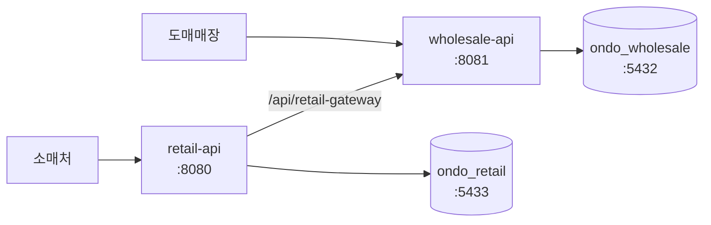

<div align="center">

# 온도 (ondo-api)

**동대문 도매↔소매 B2B 주문 플랫폼**


</div>

## 무슨 문제를 푸는가

동대문 의류 시장에서 도매상과 소매상은 **전화와 수기 장부로 주문을 주고받는다.**
주문을 받고, 물건이 없으면 미송으로 남기고, 대금은 나중에 정산하는 과정이 수첩과 기억에 흩어져 있다.
주문이 어디까지 갔는지 물으려면 다시 전화를 걸어야 한다.

온도는 그 과정을 시스템으로 옮긴다. 기획서를 먼저 쓰지 않고 **도매 사장님들을 직접 만나
주문이 오가는 순서를 듣고, 그 순서를 그대로 API 와 테이블로 옮겼다.**

- 도매가 상품을 한 번 등록하면 소매 마켓에 그대로 노출된다
- 소매가 넣은 주문은 도매 ERP 로 바로 들어온다
- 출고·미송·미수처럼 그동안 카카오톡으로 따로 알리던 내용도 소매처 화면에서 확인된다

## 구성



**서버도 DB 도 따로다.** 도매와 소매는 영업 시간대와 사용량 곡선이 다르고,
한쪽 장애가 다른 쪽으로 번지면 안 된다. 한 트랜잭션으로 묶을 수 없으니
서버 간 연동은 API 호출로 하고, 소매 전용 게이트웨이는 프라이빗 서브넷의 내부 ALB 에만 노출한다.

| | 다루는 것 |
|---|---|
| **도매 ERP** (`wholesale-api`) | 상품·재고, 주문, 출고, 미송, 정산(미수 원장), 대시보드 집계, 소매 접점 게이트웨이 |
| **소매 마켓** (`retail-api`) | 인증, 상품 목록, 장바구니, 주문, 미송, 정산 조회, 파일 업로드, 도매 서버 연동 |

## 눈여겨볼 곳

| 무엇 | 어디 |
|---|---|
| 미수 원장 — 잔액을 고치지 않고 줄을 쌓는 구조 | `feat/MUL-123-settlement-ledger` |
| 접수 대기함 — 도매가 멈춰도 주문이 남게 | `feat/MUL-139-order-dispatch` |
| 부하 테스트 시나리오와 측정 기록 | `load/` |
| AWS 인프라 (VPC·ECS·RDS·ALB·WAF) | `infra/` |

## 폴더

| 폴더 | 내용 |
|---|---|
| `retail-api/` | 소매 API |
| `wholesale-api/` | 도매 API |
| `db/` | 로컬 DB 두 대를 띄우는 compose |
| `monitoring/` | 로컬 모니터링(프로메테우스 + 그라파나) compose |
| `infra/` | AWS 인프라 Terraform |
| `load/` | 부하 테스트 시나리오와 측정 기록 |

## 로컬에서 띄우기

```bash
docker compose -f db/compose.yml up -d
```

PostgreSQL 16 두 대가 선다.

| | 데이터베이스 | 포트 | 계정 |
|---|---|---|---|
| 도매 | `ondo_wholesale` | `5432` | `ondo` / `ondo` |
| 소매 | `ondo_retail` | `5433` | `ondo` / `ondo` |

```bash
cd wholesale-api && ./gradlew bootRun     # 8081
cd retail-api    && ./gradlew bootRun     # 8080
```

> [!NOTE]
> **앱이 뜰 때 Flyway 가 자기 스키마를 넣는다.** 빈 DB 로 시작해도 된다.

## 모니터링 (로컬 전용)

```bash
docker compose -f monitoring/compose.yml up -d
```

| | 주소 | |
|---|---|---|
| 그라파나 | `localhost:3030` | 로그인 없음. "도매 API" · "소매 API" 대시보드가 자동으로 있다 |
| 프로메테우스 | `localhost:9090` | |

프로메테우스가 도매 API(8081)와 소매 API(8080)의 `/actuator/prometheus` 를 5초마다 긁고,
그라파나가 그걸 보여준다. 앱을 띄운 상태여야 데이터가 잡힌다 — 안 띄운 쪽은
프로메테우스 대상 목록에 down 으로 보일 뿐이다.

대시보드에서 보는 것 — HTTP 처리량·에러율·p95/p99 지연, 느린 API 상위 5개,
Hikari 커넥션 풀, JVM 힙.

> [!IMPORTANT]
> 메트릭 노출은 local 프로파일에서만 열린다. 배포는 health 만 나간다.

## 스키마를 바꿀 때

```
wholesale-api/src/main/resources/db/migration/
retail-api/src/main/resources/db/migration/
```

**자기 프로젝트 폴더에** `V2__...sql` 을 **추가**한다.

> [!WARNING]
> 이미 적용된 파일은 고치지 않는다 — Flyway 가 막는다.

## 규칙

- Java 21 · Spring Boot 4.1.1 · Gradle(Groovy)
- `main` 직접 푸시 금지. `dev` 에서 피처 브랜치를 따고 `dev` 로 PR
- **비밀은 커밋하지 않는다.** 환경변수로 주입한다
- 커밋 접두사 — `feat` · `fix` · `refactor` · `test` · `docs` · `chore`

## 팀

AI-SW 마에스트로 17기 · 3인 (백엔드 2 · 프론트엔드 1)
화면은 별도 저장소에서 프론트엔드가 맡고, 주고받을 API 규격을 먼저 문서로 정해 두고 각자 개발한다.
