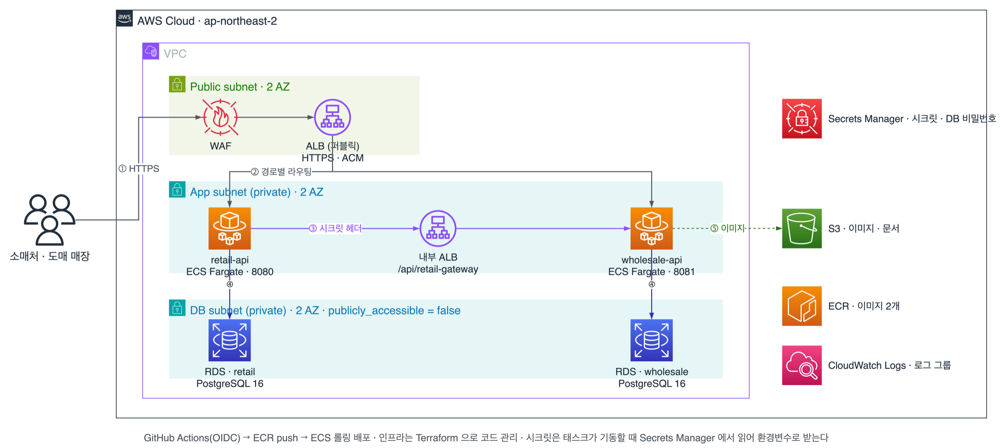

<div align="center">

# 온도 (ondo-api)

**동대문 도매↔소매 B2B 주문 플랫폼**


</div>

## 무슨 문제를 푸는가

동대문 의류 시장에서 도매상과 소매상은 **전화와 수기 장부로 주문을 주고받는다.**
주문을 받고, 물건이 없으면 미송으로 남기고, 대금은 나중에 정산하는 과정이 수첩과 기억에 흩어져 있다.
주문이 어디까지 갔는지 물으려면 다시 전화를 걸어야 한다.

온도는 그 과정을 시스템으로 옮긴다. 기획서를 먼저 쓰지 않고 **도매 사장님들을 직접 만나
주문이 오가는 순서를 듣고, 그 순서를 그대로 API 와 테이블로 옮겼다.**

- 도매가 상품을 한 번 등록하면 소매 마켓에 그대로 노출된다
- 소매가 넣은 주문은 도매 ERP 로 바로 들어온다
- 출고·미송·미수처럼 그동안 카카오톡으로 따로 알리던 내용도 소매처 화면에서 확인된다

## 구성

<div align="center">
  
</div>

<div align="center"><sub>도식 원본은 <code>docs/architecture.drawio</code></sub></div>


**서버도 DB 도 따로다.** 도매와 소매는 영업 시간대와 사용량 곡선이 다르고,
한쪽 장애가 다른 쪽으로 번지면 안 된다. 한 트랜잭션으로 묶을 수 없으니
서버 간 연동은 API 호출로 하고, 소매 전용 게이트웨이는 프라이빗 서브넷의 내부 ALB 에만 노출한다.

| | 다루는 것 |
|---|---|
| **도매 ERP** (`wholesale-api`) | 상품·재고, 주문, 출고, 미송, 정산(미수 원장), 대시보드 집계, 소매 접점 게이트웨이 |
| **소매 마켓** (`retail-api`) | 인증, 상품 목록, 장바구니, 주문, 미송, 정산 조회, 파일 업로드, 도매 서버 연동 |

## 막혔던 곳과 푼 방법

네 군데를 재봤다. 셋은 고쳤고, 하나는 재놓고 아직 안 넣었다.

### 동시에 들어오면 미수 잔액이 틀어진다

미수 잔액은 출고, 입금, 입금 취소, 배분 네 군데서 바뀐다. 처음에는 거래처마다 잔액 칸을
하나 두고 그 값을 고쳤다. 요청이 겹치면 값이 덮어써진다. 나중에 숫자가 이상해도 왜 그렇게
됐는지 볼 방법이 없었고, 입금 취소는 행을 지워서 기록도 안 남았다.

**잔액을 고치는 대신 원장에 줄을 추가한다.** 줄마다 변화량과 그때 잔액을 같이 적는다.

| 종류 | 변화량 | 그 시점 잔액 | 근거 |
|---|---:|---:|---|
| 출고 `OUTBOUND` | +900,000 | 900,000 | 주문 12 · 봉투 JG-0004 |
| 입금 `PAYMENT` | −500,000 | 400,000 | 계좌이체 · 배분 2건 |
| 입금취소 `VOID` | +500,000 | 900,000 | 착오 입금 · 사유 기록 |
| 입금 `PAYMENT` | −900,000 | 0 | 재등록 · 전액 정산 |

취소도 줄을 지우지 않고 반대 부호로 한 줄 더 넣는다. 종류와 부호가 안 맞으면 DB CHECK 가
막는다.

거래처 행은 `FOR UPDATE` 로 잠갔다. 추가만 하니까 덮어쓸 값은 없는데, **두 요청이 같은
잔액을 읽고 출발하면 적어 두는 잔액이 같아진다.** 그래서 순서를 세웠다.

같은 거래처에 동시 16세션 × 40건 = 640건을 넣었다. 전부 +1,000 이라 정상이면 잔액이
640,000 이어야 한다.

| 전략 | 요약 잔액 | 순서 오류 | 재시도 | 못 넣음 |
|---|---:|---:|---:|---:|
| 잠금 없음 | 70,000 | 570 | 0 | 0 |
| 낙관적 락 | 639,000 | 0 | 4,556 | 1 |
| **비관적 락** ← 택함 | **640,000** | 0 | 0 | 0 |

잠금을 빼면 **89% 가 사라진다.** 낙관적 락은 숫자가 맞았지만 4,556번 재시도하고도 1건을
못 넣었다 — 출고는 됐는데 미수에 안 잡히는 건이 생긴다. 비관적 락은 숫자가 맞으면서 잠금
없는 것보다 38ms 느렸다. 잠금 안에서 원장 쓰기 말고 아무것도 안 해서다.

> 브랜치 `feat/MUL-123-settlement-ledger`

### 주문이 쌓이면 대시보드가 느려진다

도매 대시보드는 열 때마다 주문, 포장, 출고, 미송을 다시 센다. 30초마다 자동으로도 갱신된다.

얼마나 쌓이면 문제가 되는지부터 잡았다. 동대문 하루 거래액이 600억이고 도매가 3만 곳이니,
건당 10만 원으로 보면 **상가 한 곳이 1년에 300만 건**이다. 그 양을 넣고 재보니 집계 6종
합계가 354ms 였다. 실행계획에서 주문과 라인, 포장이 전부 Seq Scan 이었다.

인덱스 7종으로 남의 도매처까지 훑는 것을 없앴다. 찾는 양은 줄었는데 세는 일은 그대로
남았다. 그래서 요약 표 네 개를 두고 도매처별로 갱신한다. 여러 요청이 동시에 만료를 봐도
advisory lock 으로 재계산은 한 번만 돈다.

입고일 지남과 미등록은 **세어두지 않았다.** 날짜가 바뀌면 값이 저절로 변해서, 세어두면
매일 다시 세는 배치가 필요하다.

| 단계 | 합계 | 무엇이 달라졌나 |
|---|---:|---|
| 인덱스 없음 | 354.0 ms | 내 도매처 조건으로 거르는데 그 인덱스가 없어 전부 훑는다 |
| + 인덱스 7종 | 67.5 ms | 찾는 양은 줄었는데 세는 일은 그대로다 |
| + 사전 집계 | 5.2 ms | 미리 세어 둔 값을 읽는다 |
| + 개수 분리 | **0.2 ms** | `count(*) over()` 가 limit 1 인데도 전체를 세고 있었다 |

대신 쓰기가 주문 건당 14% 늘었다. **캐시는 넣지 않았다** — 재계산을 켜고 끈 응답 차이가
0.5ms 라 읽기가 병목이 아니었다. 그 판단은 `load/dashboard/README.md` 에 남겼다.

부하를 걸다가 읽기 전용 트랜잭션 안에서 DELETE 를 하는 곳과 커넥션 풀이 스스로 막히는
곳을 찾아 고쳤다. 테스트 767개를 통과한 코드에서 나온 문제다.

> `load/dashboard/`

### 도매가 멈추면 주문이 사라진다

도매 서버가 멈추면 주문서는 소매에 남는데 접수가 안 된다. 다시 보내는 것은 사용자 몫이다.
실패를 본 소매처는 보통 다시 누르지 않고 다른 도매를 찾는다. 그렇다고 계속 재시도하면
도매가 살아나는 순간 밀린 요청이 한꺼번에 몰린다. 막 일어난 도매가 다시 쓰러진다.

접수 대기함을 주문서와 같은 트랜잭션에 쓴다. 실패한 뒤가 아니라 **도매를 부르기 전에 미리
적는다.** 호출 도중에 태스크가 내려가도 주문 의사는 남는다.

워커가 `SKIP LOCKED` 로 나눠 집고, 도매 호출은 트랜잭션 밖에서 한다. 잠금을 쥔 채로 HTTP 를
부르면 커넥션 풀이 마른다.

기한은 30분과 영업일 경계 중 이른 쪽으로 뒀다. 너무 늦게 성공하면 소매처가 이미 다른 데서
샀을 수 있고, 경계를 넘기면 장부 날짜가 어긋난다. 도매가 재고 없다고 거절한 건과 도매가 안
떠서 못 보낸 건은 다른 상태로 나눴다. 앞쪽은 몇 번을 해도 실패해서 바로 끝낸다.

밀린 주문 200건 · 도매 장애 10초 · 3회 중앙값으로 세 정책을 비교했다.

| 정책 | 살아난 순간 몰림 | 도매 호출 | 무엇이 달라지나 |
|---|---:|---:|---|
| 고정 간격 | 124 건 | 9,193 | 간격 없이 계속 보낸다 |
| 지수 백오프 | 141 건 | 1,401 | 호출은 줄었는데 같은 시각에 몰린다 |
| **지수 + 지터** ← 택함 | **25 건** | 1,374 | 깨어나는 시각이 흩어진다 |

지수 백오프로 도매 호출이 **85% 줄었다.** 대신 몰림은 141건으로 남는다. 고정 간격이
124건으로 더 적은 건 간격 없이 계속 보내 애초에 퍼져 있기 때문이고, 호출은 6.6배다.
지터를 넣으니 141건이 **25건**이 됐다. 지수만으로는 안 줄어든다 — 같은 순간에 실패한
건들이 같은 곡선을 타서다.

측정을 네 번 고쳤다. 한 번만 쟀을 때 87 이 나와서 줄어든 줄 알았는데, 3회 중앙값으로 보니
141 이었다.

> 브랜치 `feat/MUL-139-order-dispatch`

### 상품 목록이 느리다 — 재놓고 아직 안 넣었다

같은 방식으로 소매 상품 목록도 쟀다. 초당 20건에서 p95 가 5,059ms 에 실패 100% 였다.
정렬 기준으로 거르는 부분 인덱스를 깔고, 전체 개수를 세던 것을 1,001개에서 끊으니
28ms 에 실패 0% 가 됐다.

**적용은 아직이다.** 개수를 끊으면 화면에 "1,000개 이상" 이라고 표기해야 하는데, 그 표기를
받을 수 있는지 프론트엔드와 먼저 정해야 한다. 서버만 고쳐서 될 일이 아니라 미뤄 뒀다.

> `load/retail/experiments/listing-index.sql` · `listing-count-cap.patch`

### 네 번 하고 남은 것

재보기 전에는 넷 다 문제가 없어 보였다. 정산은 막는 장치를 빼고 한꺼번에 넣어 보고서야
잔액이 틀어지는 것을 봤고, 대시보드는 실행계획을 열어 보고서야 어디를 훑는지 알았고,
접수 대기함은 도매를 일부러 멈춰 보고서야 주문이 어떻게 사라지는지 봤다. 그 뒤로는
고치기 전에 먼저 재고, 고친 다음 같은 조건에서 다시 재는 순서를 지키고 있다.

**되돌릴 수 없는 값은 기능보다 먼저 자리를 잡아야 한다.** 잔액을 칸 하나에 들고 있다가
원장으로 바꾸고 멱등을 먼저 깔아 두니, 뒤에 기능을 얹을 때 확인이 훨씬 빨랐다. 기능을
먼저 만들고 예외를 나중에 붙였다면 붙일 때마다 처음부터 다시 봐야 했을 것이다.

> [!NOTE]
> 여기 적은 숫자는 전부 만든 조건에서 나왔다. 부하 시험과 장애 재현이라
> 실제 소매처가 쓰는 동안의 값은 아직 없다.


## 폴더

| 폴더 | 내용 |
|---|---|
| `retail-api/` | 소매 API |
| `wholesale-api/` | 도매 API |
| `db/` | 로컬 DB 두 대를 띄우는 compose |
| `monitoring/` | 로컬 모니터링(프로메테우스 + 그라파나) compose |
| `infra/` | AWS 인프라 Terraform |
| `load/` | 부하 테스트 시나리오와 측정 기록 |

## 로컬에서 띄우기

```bash
docker compose -f db/compose.yml up -d
```

PostgreSQL 16 두 대가 선다.

| | 데이터베이스 | 포트 | 계정 |
|---|---|---|---|
| 도매 | `ondo_wholesale` | `5432` | `ondo` / `ondo` |
| 소매 | `ondo_retail` | `5433` | `ondo` / `ondo` |

```bash
cd wholesale-api && ./gradlew bootRun     # 8081
cd retail-api    && ./gradlew bootRun     # 8080
```

> [!NOTE]
> **앱이 뜰 때 Flyway 가 자기 스키마를 넣는다.** 빈 DB 로 시작해도 된다.

## 모니터링 (로컬 전용)

```bash
docker compose -f monitoring/compose.yml up -d
```

| | 주소 | |
|---|---|---|
| 그라파나 | `localhost:3030` | 로그인 없음. "도매 API" · "소매 API" 대시보드가 자동으로 있다 |
| 프로메테우스 | `localhost:9090` | |

프로메테우스가 도매 API(8081)와 소매 API(8080)의 `/actuator/prometheus` 를 5초마다 긁고,
그라파나가 그걸 보여준다. 앱을 띄운 상태여야 데이터가 잡힌다 — 안 띄운 쪽은
프로메테우스 대상 목록에 down 으로 보일 뿐이다.

대시보드에서 보는 것 — HTTP 처리량·에러율·p95/p99 지연, 느린 API 상위 5개,
Hikari 커넥션 풀, JVM 힙.

> [!IMPORTANT]
> 메트릭 노출은 local 프로파일에서만 열린다. 배포는 health 만 나간다.

## 스키마를 바꿀 때

```
wholesale-api/src/main/resources/db/migration/
retail-api/src/main/resources/db/migration/
```

**자기 프로젝트 폴더에** `V2__...sql` 을 **추가**한다.

> [!WARNING]
> 이미 적용된 파일은 고치지 않는다 — Flyway 가 막는다.

## 규칙

- Java 21 · Spring Boot 4.1.1 · Gradle(Groovy)
- `main` 직접 푸시 금지. `dev` 에서 피처 브랜치를 따고 `dev` 로 PR
- **비밀은 커밋하지 않는다.** 환경변수로 주입한다
- 커밋 접두사 — `feat` · `fix` · `refactor` · `test` · `docs` · `chore`

## 팀

AI-SW 마에스트로 17기 · 3인 (백엔드 2 · 프론트엔드 1)
화면은 별도 저장소에서 프론트엔드가 맡고, 주고받을 API 규격을 먼저 문서로 정해 두고 각자 개발한다.

내가 맡은 곳 —

| | |
|---|---|
| 소매 서버 | 인증, 장바구니, 주문, 상품 목록, 미송, 정산 조회, 파일 업로드 |
| 도매 서버 | 정산 도메인(미수 원장·입금·배분·취소), 소매 접점 게이트웨이, 대시보드 집계 |
| 인프라 | VPC, ECS Fargate, RDS, ALB, WAF 를 Terraform 으로 구성하고 GitHub Actions(OIDC) 로 배포 |
