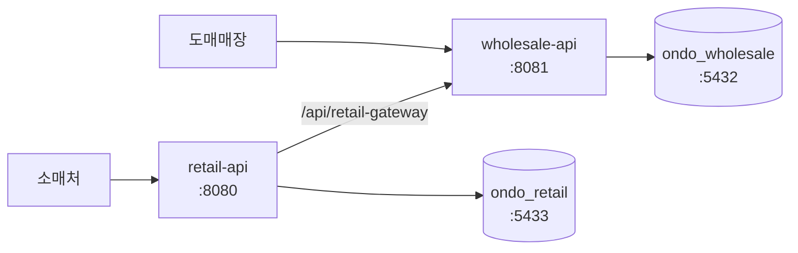

<div align="center">

# ondo-api

**동대문 도매↔소매 B2B — 서버 둘 · DB 둘**


</div>



도매와 소매는 **서버도 DB 도 따로다.** 한 트랜잭션으로 묶을 수 없으니 서버 간 연동은 API 호출로 한다.

## 폴더

| 폴더 | 내용 |
|---|---|
| `retail-api/` | 소매 API |
| `wholesale-api/` | 도매 API |
| `db/` | 로컬 DB 두 대를 띄우는 compose |
| `monitoring/` | 로컬 모니터링(프로메테우스 + 그라파나) compose |
| `infra/` | AWS 인프라 Terraform |
| `load/` | 부하 테스트 시나리오와 측정 기록 |

## 로컬에서 띄우기

```bash
docker compose -f db/compose.yml up -d
```

PostgreSQL 16 두 대가 선다.

| | 데이터베이스 | 포트 | 계정 |
|---|---|---|---|
| 도매 | `ondo_wholesale` | `5432` | `ondo` / `ondo` |
| 소매 | `ondo_retail` | `5433` | `ondo` / `ondo` |

```bash
cd wholesale-api && ./gradlew bootRun     # 8081
cd retail-api    && ./gradlew bootRun     # 8080
```

> [!NOTE]
> **앱이 뜰 때 Flyway 가 자기 스키마를 넣는다.** 빈 DB 로 시작해도 된다.

## 모니터링 (로컬 전용)

```bash
docker compose -f monitoring/compose.yml up -d
```

| | 주소 | |
|---|---|---|
| 그라파나 | `localhost:3030` | 로그인 없음. "도매 API" · "소매 API" 대시보드가 자동으로 있다 |
| 프로메테우스 | `localhost:9090` | |

프로메테우스가 도매 API(8081)와 소매 API(8080)의 `/actuator/prometheus` 를 5초마다 긁고,
그라파나가 그걸 보여준다. 앱을 띄운 상태여야 데이터가 잡힌다 — 안 띄운 쪽은
프로메테우스 대상 목록에 down 으로 보일 뿐이다.

대시보드에서 보는 것 — HTTP 처리량·에러율·p95/p99 지연, 느린 API 상위 5개,
Hikari 커넥션 풀, JVM 힙.

> [!IMPORTANT]
> 메트릭 노출은 local 프로파일에서만 열린다. 배포는 health 만 나간다.

## 스키마를 바꿀 때

```
wholesale-api/src/main/resources/db/migration/
retail-api/src/main/resources/db/migration/
```

**자기 프로젝트 폴더에** `V2__...sql` 을 **추가**한다.

> [!WARNING]
> 이미 적용된 파일은 고치지 않는다 — Flyway 가 막는다.

## 규칙

- Java 21 · Spring Boot 4.1.1 · Gradle(Groovy)
- `main` 직접 푸시 금지. `dev` 에서 피처 브랜치를 따고 `dev` 로 PR
- **비밀은 커밋하지 않는다.** 환경변수로 주입한다
- 커밋 접두사 — `feat` · `fix` · `refactor` · `test` · `docs` · `chore`
